# 🏠 자취생존 (Surviving Solo)
> **"혼자서 짊어진 생활 관리의 짐을 덜어주는 스마트 개인 비서"**

## 📖 프로젝트 개요
**자취생존**은 1인 가구가 겪는 식재료 관리, 생필품 구매, 가사 노동의 부담을 덜어주기 위해 기획된 **올인원 생활 매니지먼트 플랫폼**입니다.
식재료 폐기, 중복 구매 등 불필요한 지출을 막고, 자취생들이 효율적인 소비 습관과 규칙적인 생활 루틴을 형성하도록 돕습니다.

* **개발 인원:** 1인 (기획, 디자인, 개발 전 과정 수행)
* **주요 기능:** 영수증 OCR 스캔, 냉장고 유통기한 관리, 레시피 추천, 생필품 지출 분석 및 공동구매

 

## 📱 주요 화면 및 기능 (Screenshots & Features)

### 1. 🧊 스마트 냉장고 & 레시피 (Food Management)
식재료의 유통기한을 자동으로 관리하고, 남은 재료를 활용한 레시피를 추천합니다.

| 영수증 스캔 (OCR) | 직접 입력 모드 | 나의 냉장고 (D-Day) | 레시피 추천 |
| :---: | :---: | :---: | :---: |
|  | 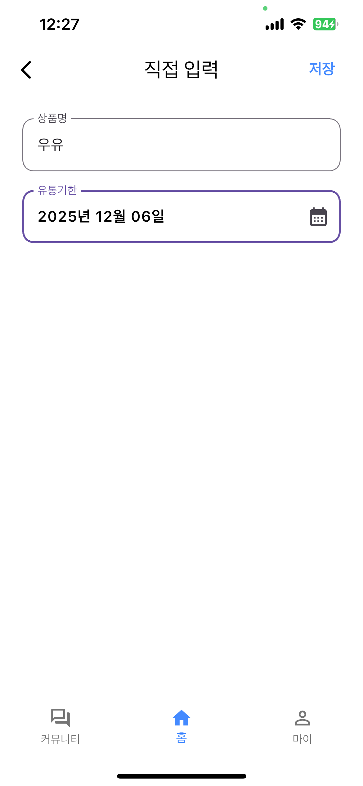 | 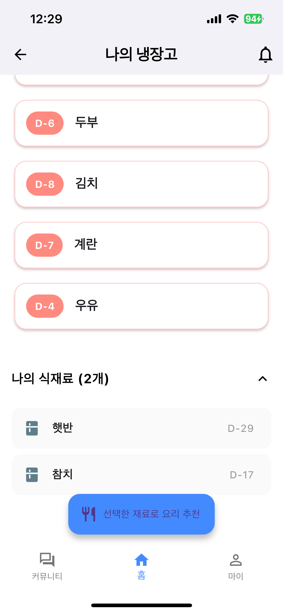 |  |
| **Google ML Kit**로 상품/가격 자동 인식 | OCR 실패 시 수동 입력 지원 | 유통기한 임박 상품 시각적 강조 (붉은색) | 보유 재료 기반 맞춤 요리법 제공 |

### 2. 💰 생필품 & 지출 관리 (Spending Analysis)
월별 지출 흐름을 파악하고, 최저가 비교 및 구독 서비스 관리를 통해 절약을 돕습니다.

| 지출 분석 그래프 | 나의 생필품 | 최저가 비교 | 정기 구독 관리 |
| :---: | :---: | :---: | :---: |
| 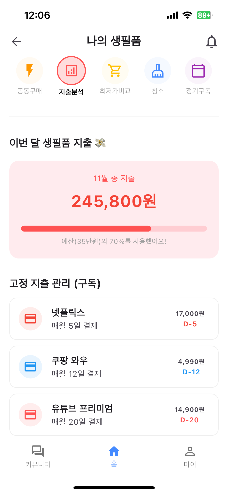 | 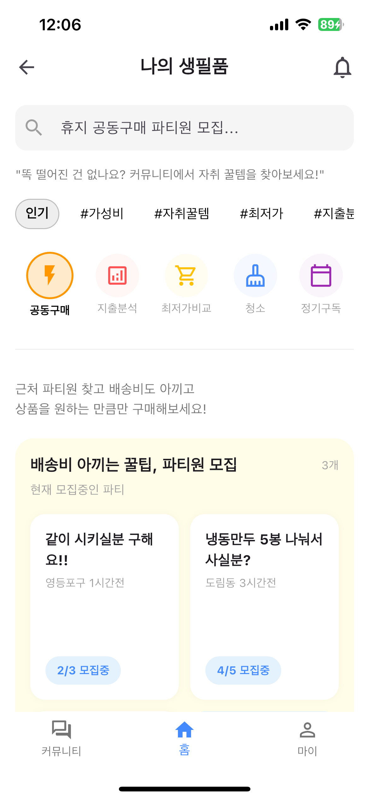 | 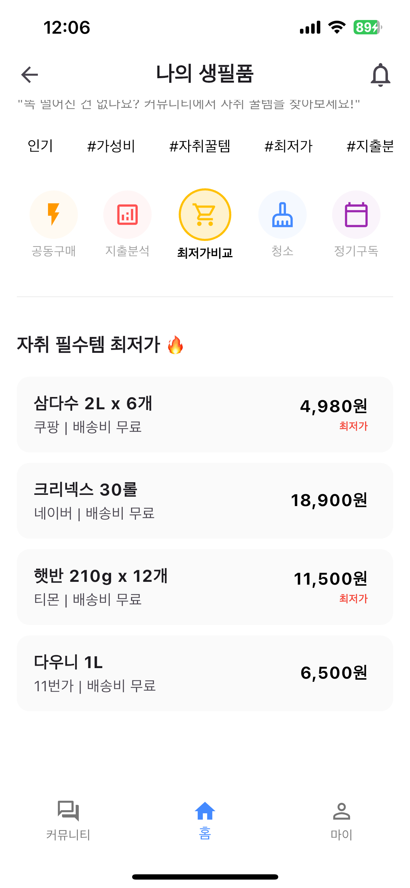 | 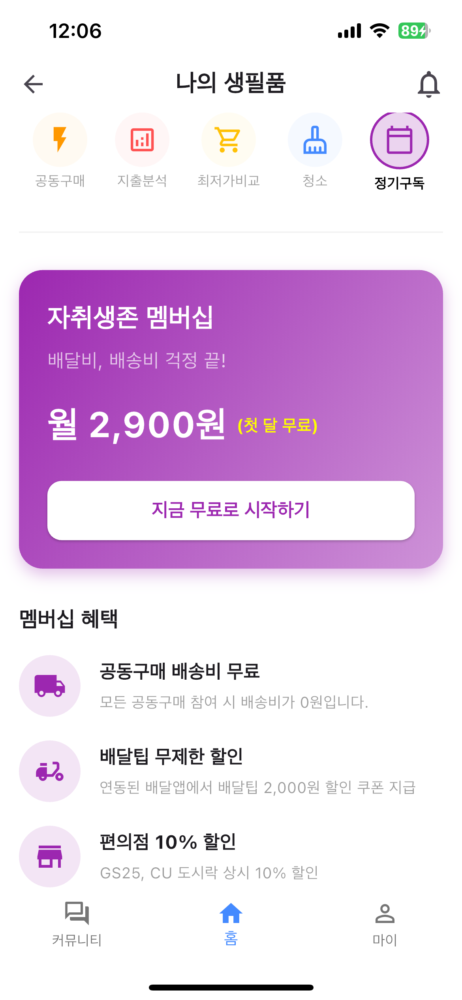 |
| 월별 생필품 지출 시각화 (Graph) | 생필품 재고 관리 및 공동구매 파티 모집 | 합리적 소비를 위한 가격 비교 검색 | 넷플릭스 등 고정 지출 D-Day |

### 3. 🧹 생활 루틴 & 커뮤니티 (Lifestyle & Community)
혼자 살 때 놓치기 쉬운 청소, 분리수거 일정을 챙기고 꿀팁을 공유합니다.

| 청소 체크리스트 | 분리수거 알림 | 커뮤니티 | 자취 꿀템 |
| :---: | :---: | :---: | :---: |
| 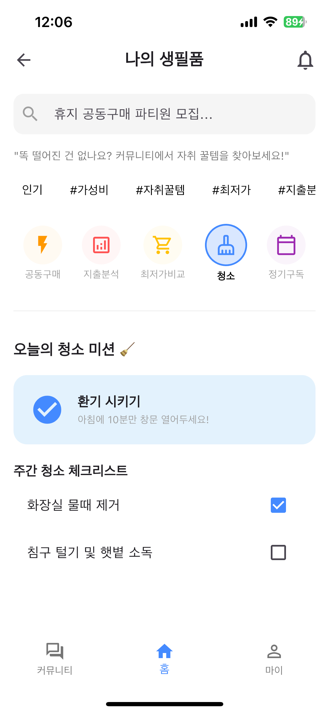 | 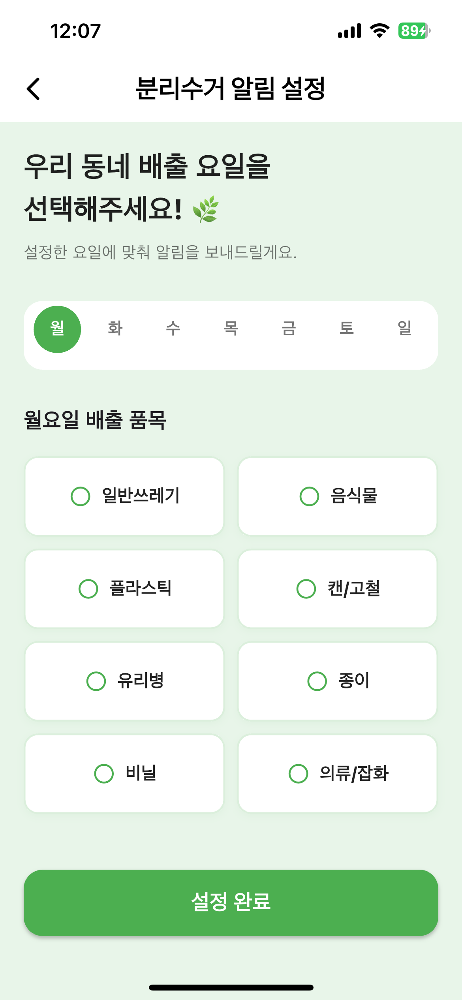 | 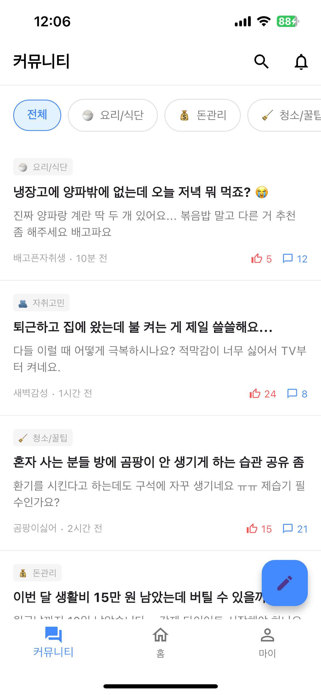 | 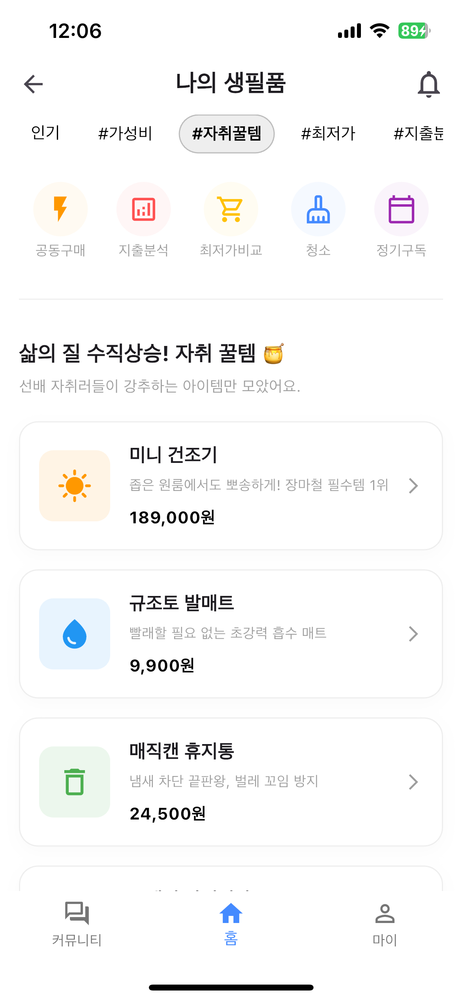 |
| 구역별 청소 주기 체크 및 관리 | 요일별 배출 품목 알림 설정 | 자취 고민 상담 및 정보 공유 게시판 | 검증된 자취 아이템 추천 큐레이션 |

### 4. ⚙️ 앱 시작 및 설정 (Start & Settings)
| 로그인 | 홈 화면 (대시보드) | 마이페이지 | 로그아웃 |
| :---: | :---: | :---: | :---: |
| 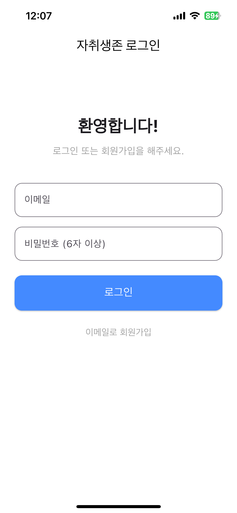 | 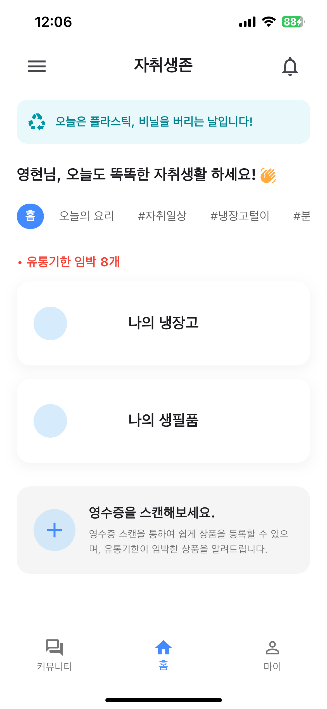 | 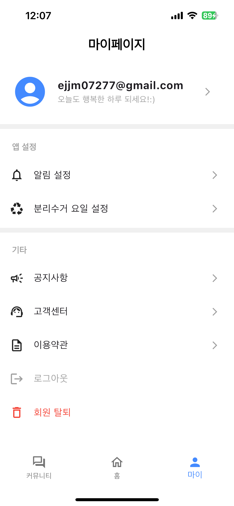 | 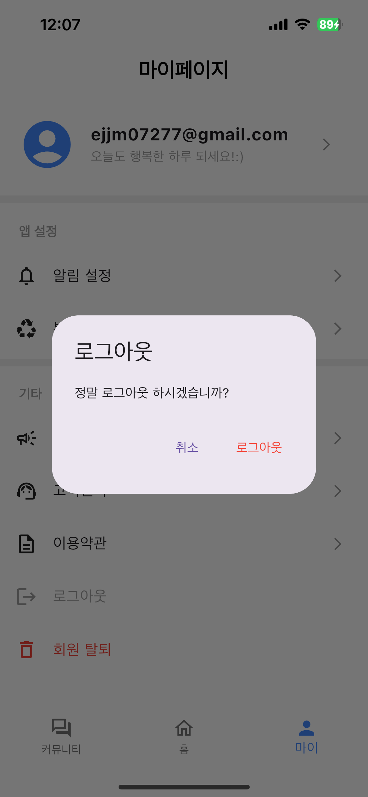 |

 

## 🛠 기술 스택 (Tech Stack)

| 구분 | 기술 | 설명 |
| --- | --- | --- |
| **Framework** | Flutter | Android/iOS 크로스 플랫폼 개발 |
| **Language** | Dart | 비동기 처리 및 UI 구현 |
| **Backend** | Firebase Auth | 이메일/비밀번호 로그인 및 세션 관리 |
| **DB** | Cloud Firestore | NoSQL 기반 실시간 데이터 동기화 |
| **Library** | google_mlkit | 텍스트 인식(OCR) 기능 구현 |
| **Library** | camera | 커스텀 카메라 뷰, 줌/포커스 제어 |

 

## 🔥 트러블 슈팅 (Troubleshooting)

개발 과정에서 마주친 주요 문제와 해결 과정입니다.

### 1. iOS 환경에서의 한글 OCR 모델 미로드 문제
* **문제:** Android와 달리 iOS 시뮬레이터에서 한글이 깨지거나 인식되지 않는 현상 발생.
* **원인:** iOS의 `CocoaPods` 설정에서 한국어 학습 모델이 기본으로 포함되지 않음.
* **해결:** `Podfile`에 `pod 'GoogleMLKit/TextRecognitionKorean'`을 명시적으로 추가하고 강제 주입하여 해결.

### 2. 촬영 환경에 따른 인식률 저하
* **문제:** 초점이 흐리거나 거리가 멀 경우 OCR 정확도가 현저히 떨어짐.
* **해결:**
    * `ResolutionPreset.veryHigh`로 카메라 해상도 상향.
    * `setFocusMode(auto)` 및 `setZoomLevel(2.0)`을 기본값으로 설정하여 하드웨어 제어.

### 3. 비정형 영수증 데이터 파싱 오류
* **문제:** 영수증의 상호명이나 층수(1F) 정보가 가격으로 오인식되어 데이터 밀림 현상 발생.
* **해결:** **규칙 기반 후처리 알고리즘** 구현.
    * `RegExp`를 이용해 날짜, 전화번호 등 노이즈 데이터 1차 필터링.
    * 상품명 리스트와 가격 리스트의 인덱스를 매칭하고, 비정상적인 가격 범위 데이터 소거.

### 4. Firestore 복합 쿼리 인덱싱 에러
* **문제:** '나의 냉장고' 로딩 시 `The query requires an index` 에러 발생.
* **원인:** `uid`(내 식재료)와 `createdAt`(등록순 정렬) 두 가지 조건을 동시에 쿼리하기 위해 복합 색인 필요.
* **해결:** Firebase Console에서 복합 인덱스를 생성하여 쿼리 성능 최적화.

 

## 🚀 향후 계획 (Roadmap)
* **바코드 스캔:** 공공 데이터 API를 연동하여 가공식품 정보 자동 등록.
* **푸시 알림 (FCM):** 유통기한 임박 및 분리수거 알림 서비스 구현.
* **위치 기반 공동구매:** 동네 인증을 통한 실시간 이웃 공동구매 매칭 시스템.

 

## 🧑‍💻 개발자 (Author)
* **이영현 (YeongHyun Lee)**
* **Role:** 기획, 디자인, Frontend, Backend
* **Contact:** (본인의 이메일 주소를 입력하세요)
